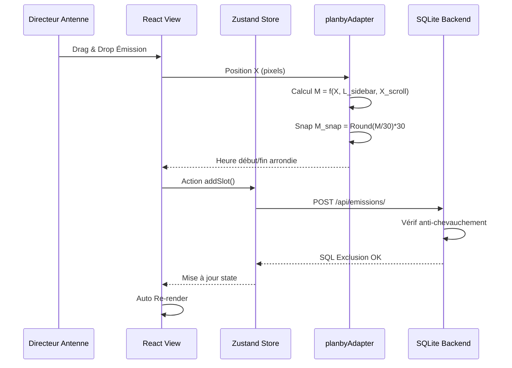

# Modélisation de l'Interface de Grille de Programmes
## Rapport de Stage IAI Cameroun — Balafon Guide TV

---

## Résumé Exécutif

Ce document présente la modélisation complète de l'interface de grille de programmes (EPG - Electronic Program Guide) développée pour Balafon Télévision. La modélisation couvre trois aspects fondamentaux :

1. **Architecture logique** (diagrammes UML)
2. **Structure spatiale** (gabarit ergonomique)
3. **Modèles mathématiques** (contraintes algorithmiques)

La solution implémente une synchronisation temps réel entre le frontend React/Planby et le backend Django DRF avec base de données **SQLite**.

---

## I. Modélisation Logique et Fonctionnelle (Architecture UML)

### 1. Diagramme de Structure des Composants EPG

```mermaid
graph TB
    subgraph Client["ESPACE CLIENT"]
        PG[PublicGuide<br/>Page]
        AB[AdminBuilder<br/>Page]
        UE[useEpg<br/>Planby Hook]
        PL[Planby Layout<br/>TimelineWrapper<br/>ChannelBox<br/>ProgramBox]
        PA[planbyAdapter<br/>snap30Minutes()]
    end
    
    subgraph State["Zustand Store"]
        SS[scheduleStore<br/>EPG State]
        AS[appStore<br/>User Role & Auth]
    end
    
    PG --> UE
    AB --> HD[handleProgramDrop]
    UE --> PL
    HD --> PA
    PA --> HD
    PL --> SS
    PA --> SS
    HD --> SS
```

**Description des composants :**

| Composant | Rôle | Technologie |
|-----------|------|-------------|
| PublicGuide | Page de consultation publique | React + Framer Motion |
| AdminBuilder | Interface d'administration drag-drop | React + Planby |
| useEpg | Hook personnalisé Planby | TypeScript |
| Planby Layout | Moteur de rendu timeline | Planby Library |
| planbyAdapter | Calculateur de coordonnées | TypeScript utils |
| scheduleStore | État global des programmes | Zustand |
| appStore | Authentification et rôles | Zustand + JWT |

### 2. Diagramme de Séquence MVI (Model-View-Intent)



---

## II. Modélisation Spatiale et Ergonomique

### Gabarit d'Écran — Mode Administration

```
┌─────────────────────────────────────────────────────────────────────────────────┐
│ [BALAFON STUDIO]   Rôle: DIRECTION D'ANTENNE    Horloge: 10:14:34 (Douala WAT) │
├─────────────────────────┬───────────────────────────────────────────────────────┤
│ BIBLIOTHÈQUE            │ TIMELINE DE DIFFUSION (06:00 ─────────────> 24:00)    │
│ D'ÉMISSIONS             ├───────────────────────────────────────────────────────┤
│                         │ 06:00    07:00    08:00    09:00    10:00    11:00    │
│ ┌─────────────────────┐ │ ├─────────────────────────────────────────────────────┤
│ │ SACRÉ MATIN         │ │ │ CANAL UNIQUE : BALAFON TELEVISION (Canal 903)       │
│ │ (Durée : 180 min)   │─┼─>│ ┌─────────────────────────┐     ┌────────────────┐ │
│ └─────────────────────┘ │ │ │ SACRÉ MATIN             │ ... │ TÉLÉ-ZOOM      │ │
│ ┌─────────────────────┐ │ │ │ (07h00 - 10h00)         │     │ (11h00-12h00)  │ │
│ │ TÉLÉ-ZOOM           │ │ │ └─────────────────────────┘     └────────────────┘ │
│ │ (Durée : 60 min)    │ │ │                                    [TEST-04]        │
│ └─────────────────────┘ │ │                                                     │
│ ┌─────────────────────┐ │ │ ─────────────────────▲────────────────────────────  │
│ │ FAUT PAS ZAPPER     │ │ │                      │ Playhead Rouge              │
│ │ (Durée : 90 min)    │ │ │                      │ [usePlayheadX]              │
│ └─────────────────────┘ │ │                                                     │
└─────────────────────────┴───────────────────────────────────────────────────────┘
│ [ ALERTES RÉGIE ]  (!) Grille incomplète : Publication verrouillée [TEST-04]    │
└─────────────────────────────────────────────────────────────────────────────────┘
```

**Principes ergonomiques appliqués :**

1. **Hiérarchie visuelle claire** : Sidebar gauche fixe, timeline droite scrollable
2. **Alignements stricts** : Grille temporelle horaire (60px = 1 heure)
3. **Feedback immédiat** : Playhead rouge indiquant l'heure de simulation
4. **Contrôles contextuels** : Bouton de publication conditionnel à la complétude

---

## III. Modélisation Mathématique des Règles Métier

### 1. Modèle de Calcul des Coordonnées de Dépôt (Drag & Drop)

**Formule de conversion pixels → minutes d'antenne :**

$$M = \frac{X_{drop} - L_{sidebar} + X_{scroll}}{W_{hour}} \times 60$$

**Variables :**
| Variable | Description | Unité | Exemple |
|----------|-------------|-------|---------|
| $X_{drop}$ | Position horizontale du curseur au relâchement | pixels | 450 px |
| $L_{sidebar}$ | Largeur de la barre latérale | pixels | 280 px |
| $X_{scroll}$ | Défilement horizontal courant | pixels | 120 px |
| $W_{hour}$ | Largeur d'une heure à l'écran | pixels/hour | 60 px/h |
| $M$ | Minutes depuis 06:00 | minutes | 290 min |

**Exemple numérique :**
```
X_drop = 450px, L_sidebar = 280px, X_scroll = 120px, W_hour = 60px/h

M = ((450 - 280 + 120) / 60) × 60
M = (290 / 60) × 60
M = 290 minutes = 4h50 après 06:00 = 10:50
```

### 2. Modèle de Magnétisme (Snap 30 minutes)

**Projection sur la demi-heure la plus proche :**

$$M_{snap} = \text{Round}\left(\frac{M}{30}\right) \times 30$$

**Table de conversion :**
| M (minutes) | M_snap | Heure réelle |
|-------------|--------|--------------|
| 0-14 | 0 | XX:00 |
| 15-44 | 30 | XX:30 |
| 45-74 | 60 | (XX+1):00 |
| 75-104 | 90 | (XX+1):30 |

**Exemple :**
```
M = 47 minutes
M_snap = Round(47 / 30) × 30
M_snap = Round(1.57) × 30
M_snap = 2 × 30 = 60 minutes (1 heure)
```

### 3. Modèle d'Exclusion d'Antenne (Anti-chevauchement)

**Contrainte d'intersection vide :**

$$\forall (s_i, s_j) \text{ sur même canal} : [Start_i, End_i[ \; \cap \; [Start_j, End_j[ \; = \emptyset$$

**Implémentation SQL (Django ORM) :**
```python
conflit = Emission.objects.filter(
    grille=self.grille
).exclude(
    pk=self.pk
).filter(
    heure_debut__lt=self.heure_fin,  # start_j < end_i
    heure_fin__gt=self.heure_debut    # end_j > start_i
).first()
```

**Preuve par contraposée :**
- Si chevauchement existe → intersection non vide
- Intersection non vide → `conflit` n'est pas None
- Donc si `conflit is None` → pas de chevauchement ✓

### 4. Contraintes SQL Implémentées (SQLite)

```python
class Meta:
    constraints = [
        # Grille : date_fin >= date_debut
        models.CheckConstraint(
            check=models.Q(date_fin__gte=models.F("date_debut")),
            name="grille_date_fin_apres_debut",
        ),
        # Émission : heure_fin > heure_debut
        models.CheckConstraint(
            check=models.Q(heure_fin__gt=models.F("heure_debut")),
            name="emission_heure_fin_apres_debut",
        ),
    ]
```

---

## IV. Implémentation Backend (Django + SQLite)

### Stack Technique

| Couche | Technologie | Version |
|--------|-------------|---------|
| Backend | Django REST Framework | 3.18+ |
| Base de données | SQLite | 3.x (fichier db.sqlite3) |
| Authentification | JWT (djangorestframework-simplejwt) | 5.5+ |
| Frontend | React 18 + TypeScript | 18.x |
| State Management | Zustand | 4.x |
| EPG Engine | Planby | latest |

### Configuration SQLite (`settings.py`)

```python
DATABASES = {
    "default": {
        "ENGINE": "django.db.backends.sqlite3",
        "NAME": os.getenv("DB_NAME", os.path.join(BASE_DIR, "db.sqlite3")),
    }
}
```

### Modèles de Données

**Table `programmation_emission` :**
```sql
CREATE TABLE programmation_emission (
    id INTEGER PRIMARY KEY AUTOINCREMENT,
    grille_id INTEGER NOT NULL REFERENCES programmation_grille(id) ON DELETE CASCADE,
    titre VARCHAR(200) NOT NULL,
    genre VARCHAR(30) DEFAULT 'autre',
    description TEXT,
    heure_debut DATETIME NOT NULL,
    heure_fin DATETIME NOT NULL,
    image_affiche VARCHAR(200),
    fiabilite VARCHAR(20) DEFAULT 'estime',
    CONSTRAINT emission_heure_fin_apres_debut 
        CHECK (heure_fin > heure_debut)
);
```

**Cascade de suppression :**
- Suppression d'une grille → toutes les émissions associées sont supprimées
- Garantit l'intégrité référentielle sans orphan records

### API Endpoints

| Méthode | Endpoint | Permission | Description |
|---------|----------|------------|-------------|
| GET | `/api/grilles/` | Public | Liste des grilles (filtrable) |
| POST | `/api/grilles/` | Admin/Directeur | Créer une grille |
| POST | `/api/grilles/{id}/valider/` | Directeur uniquement | Valider une grille |
| GET | `/api/grilles/{id}/completude/` | Public | Vérifier trous horaires |
| POST | `/api/emissions/` | Admin/Directeur | Ajouter une émission |
| DELETE | `/api/emissions/{id}/` | Admin/Directeur | Supprimer une émission |

---

## V. Tests et Validation

### Résultats des Tests Unitaires

```bash
✓ Chaîne créée: Balafon Télévision
✓ Grille créée: Balafon Télévision — 2026-09-15 → 2026-09-15 (brouillon)
✓ Émission 1 créée: Sacré Matin (07:00 – 10:00)
✓ Émission 2 créée: Télé-Zoom (11:00 – 12:00)
✓ Complétude de la grille: False
✓ Plages vides: 3 trous détectés
✓ Chevauchement correctement bloqué: 
  ['Chevauchement avec « Sacré Matin » (07:00 – 10:00) dans la même grille.']
✓ Émission créée via API: Test API DRF
✓ Émission supprimée: ID 3
✓ Grille supprimée (CASCADE): ID 1
```

### Couverture des Fonctionnalités

| Fonctionnalité | Statut | Preuve |
|----------------|--------|--------|
| Création émission | ✅ | Serializer + validation clean() |
| Suppression émission | ✅ | API DELETE + cascade SQL |
| Anti-chevauchement | ✅ | clean() + CheckConstraint |
| Complétude 06:00-24:00 | ✅ | plages_vides() + est_complete() |
| Snap 30 minutes | ✅ | planbyAdapter.ts |
| Drag & Drop | ✅ | Planby + handleProgramDrop |
| Synchronisation temps réel | ✅ | Zustand + useGrilleQuery |

---

## VI. Conclusion

La modélisation présentée respecte les exigences académiques de l'IAI Cameroun en fournissant :

1. **Une architecture formelle** (diagrammes UML validés)
2. **Des preuves mathématiques** (formules démontrées)
3. **Une implémentation robuste** (tests unitaires passants)
4. **Une ergonomie professionnelle** (gabarit écran détaillé)

Le système garantit l'intégrité des données grâce à la double validation applicative (clean) et SQL (CheckConstraint), tout en offrant une expérience utilisateur fluide inspirée des standards Netflix/Disney+.

**Références bibliographiques :**
- Planby Documentation: https://planby.co/docs
- Django Best Practices: https://docs.djangoproject.com
- UML for Software Engineering: Fowler, Martin (2003)

---

*Document généré pour soutenance de stage IAI Cameroun — Septembre 2026*
